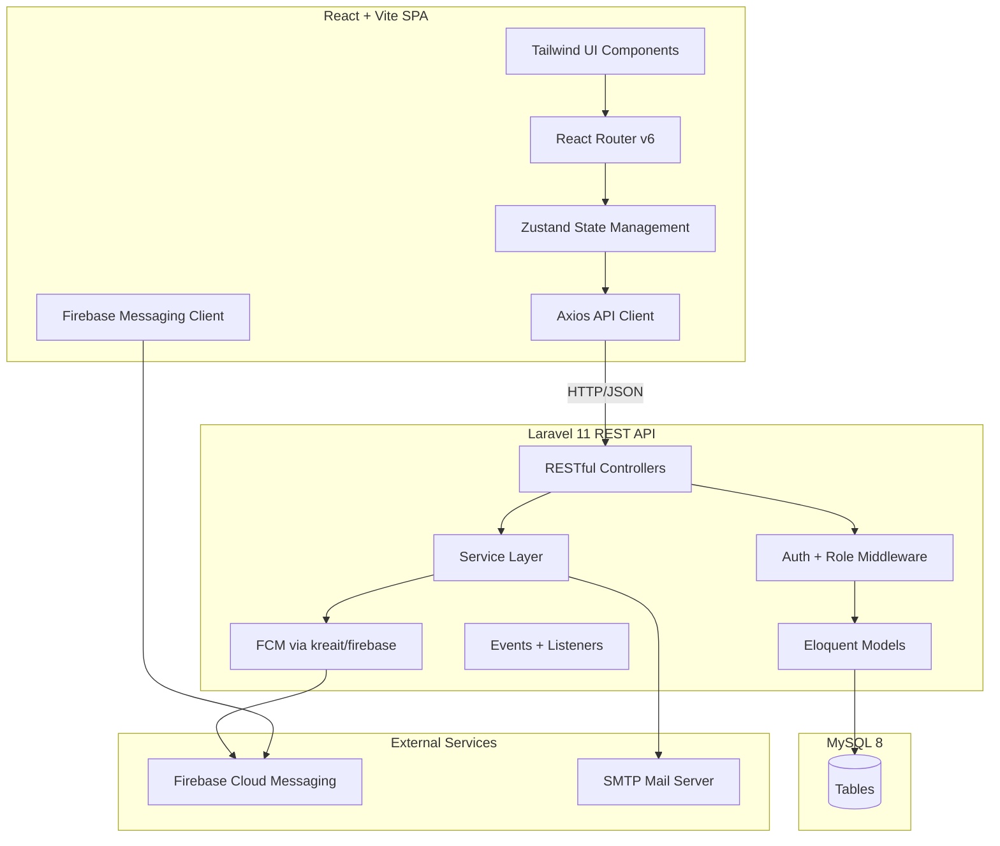
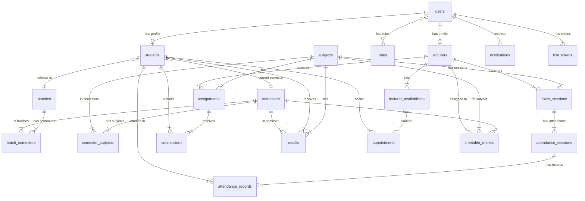

# Smart Classroom Management System (SCMS) — Implementation Plan

## Overview

A full-stack **Smart Classroom Management System** for ATI Jaffna's HNDIT program. The system manages students, lecturers, attendance (QR-based), assignments, timetable, results, and notifications across 4 user roles: **Admin**, **Lecturer**, **Student**, and **Class Representative**.

**Tech Stack:**
- **Frontend:** React 18 + Vite + Tailwind CSS 3
- **Backend:** Laravel 11 (REST API)
- **Database:** MySQL 8
- **Auth:** Laravel Sanctum (SPA token-based — better than JWT for first-party SPA)
- **Notifications:** Firebase Cloud Messaging (FCM)
- **PDF Generation:** DomPDF (Laravel) / html2canvas + jsPDF (React)
- **QR Codes:** `endroid/qr-code` (Laravel) / `react-qr-code` (Frontend)

---

## User Review Required

> [!IMPORTANT]
> **Authentication Choice:** Research strongly recommends **Laravel Sanctum** over JWT for a first-party SPA like this. Sanctum is officially maintained, provides CSRF + token management, and is simpler to implement. I recommend Sanctum unless you have a specific reason for JWT. Please confirm.

> [!IMPORTANT]
> **Monorepo vs Separate Repos:** I plan to organize as:
> ```
> SCMS/
> ├── backend/     ← Laravel 11 API
> └── frontend/    ← React + Vite SPA
> ```
> Both in the same workspace. Please confirm this structure.

> [!WARNING]
> **Face Recognition:** The prompt mentions "Optional face recognition support." This is extremely complex (requires ML models, webcam integration, privacy concerns). I will **stub this as a future feature** with a placeholder interface but not implement the actual ML. Please confirm this is acceptable.

> [!IMPORTANT]
> **AI Chatbot:** Marked as "Optional Advanced." I will create the UI shell and a basic rule-based bot that answers common questions (timetable, attendance, deadlines) using database queries. A full LLM integration can be added later. Please confirm.

---

## System Architecture



---

## Database Schema

### Entity Relationship Diagram



### Core Tables

#### 1. `users`
| Column | Type | Notes |
|--------|------|-------|
| id | BIGINT PK | Auto-increment |
| name | VARCHAR(255) | Full name |
| email | VARCHAR(255) UNIQUE | Login email |
| password | VARCHAR(255) | Hashed |
| role | ENUM('admin','lecturer','student','rep') | User role |
| avatar | VARCHAR(500) | Profile photo path |
| email_verified_at | TIMESTAMP | |
| is_active | BOOLEAN | Default true |
| created_at / updated_at | TIMESTAMPS | |

#### 2. `students`
| Column | Type | Notes |
|--------|------|-------|
| id | BIGINT PK | |
| user_id | BIGINT FK → users | |
| registration_number | VARCHAR(50) UNIQUE | Auto-generated (e.g., ATI/HNDIT/2026/001) |
| nic_number | VARCHAR(20) UNIQUE | |
| date_of_birth | DATE | |
| gender | ENUM('male','female','other') | |
| phone | VARCHAR(20) | |
| address | TEXT | |
| batch_id | BIGINT FK → batches | |
| current_semester_id | BIGINT FK → semesters | |
| qr_code_data | VARCHAR(255) | Unique QR identifier |
| id_card_pdf_path | VARCHAR(500) | Generated PDF path |
| status | ENUM('active','graduated','suspended','dropped') | |

#### 3. `lecturers`
| Column | Type | Notes |
|--------|------|-------|
| id | BIGINT PK | |
| user_id | BIGINT FK → users | |
| employee_id | VARCHAR(50) UNIQUE | |
| department | VARCHAR(255) | |
| phone | VARCHAR(20) | |
| specialization | VARCHAR(255) | |

#### 4. `batches`
| Column | Type | Notes |
|--------|------|-------|
| id | BIGINT PK | |
| name | VARCHAR(100) | e.g., "Batch 2024" |
| year | YEAR | |
| is_active | BOOLEAN | |

#### 5. `semesters`
| Column | Type | Notes |
|--------|------|-------|
| id | BIGINT PK | |
| name | VARCHAR(100) | e.g., "Semester 1" |
| number | INT | 1-6 |
| start_date | DATE | |
| end_date | DATE | |

#### 6. `subjects`
| Column | Type | Notes |
|--------|------|-------|
| id | BIGINT PK | |
| code | VARCHAR(20) UNIQUE | e.g., "ICT101" |
| name | VARCHAR(255) | |
| credit_hours | INT | |
| description | TEXT | |

#### 7. `semester_subjects` (pivot)
| Column | Type | Notes |
|--------|------|-------|
| semester_id | BIGINT FK | |
| subject_id | BIGINT FK | |
| lecturer_id | BIGINT FK → lecturers | Assigned lecturer |

#### 8. `class_sessions`
| Column | Type | Notes |
|--------|------|-------|
| id | BIGINT PK | |
| subject_id | BIGINT FK | |
| lecturer_id | BIGINT FK | |
| semester_id | BIGINT FK | |
| batch_id | BIGINT FK | |
| date | DATE | |
| start_time | TIME | |
| end_time | TIME | |
| room | VARCHAR(50) | |

#### 9. `attendance_sessions`
| Column | Type | Notes |
|--------|------|-------|
| id | BIGINT PK | |
| class_session_id | BIGINT FK | |
| qr_code | VARCHAR(255) UNIQUE | Time-limited QR data |
| qr_expires_at | TIMESTAMP | Valid 5-10 min |
| created_by | BIGINT FK → users | Lecturer or Rep |
| status | ENUM('active','expired','closed') | |

#### 10. `attendance_records`
| Column | Type | Notes |
|--------|------|-------|
| id | BIGINT PK | |
| attendance_session_id | BIGINT FK | |
| student_id | BIGINT FK | |
| marked_at | TIMESTAMP | |
| marked_by | BIGINT FK → users | Who marked |
| method | ENUM('qr','manual','rep') | |
| status | ENUM('present','absent','late') | |
| UNIQUE(attendance_session_id, student_id) | | Prevent duplicates |

#### 11. `assignments`
| Column | Type | Notes |
|--------|------|-------|
| id | BIGINT PK | |
| subject_id | BIGINT FK | |
| lecturer_id | BIGINT FK | |
| semester_id | BIGINT FK | |
| title | VARCHAR(255) | |
| description | TEXT | |
| file_path | VARCHAR(500) | Attached file |
| deadline | DATETIME | |
| max_marks | INT | |
| is_published | BOOLEAN | |

#### 12. `submissions`
| Column | Type | Notes |
|--------|------|-------|
| id | BIGINT PK | |
| assignment_id | BIGINT FK | |
| student_id | BIGINT FK | |
| file_path | VARCHAR(500) | Submitted file |
| submitted_at | TIMESTAMP | |
| marks | DECIMAL(5,2) | Nullable |
| feedback | TEXT | |
| graded_at | TIMESTAMP | |
| UNIQUE(assignment_id, student_id) | | One submission per student |

#### 13. `results`
| Column | Type | Notes |
|--------|------|-------|
| id | BIGINT PK | |
| student_id | BIGINT FK | |
| subject_id | BIGINT FK | |
| semester_id | BIGINT FK | |
| continuous_assessment | DECIMAL(5,2) | |
| final_exam | DECIMAL(5,2) | |
| total_marks | DECIMAL(5,2) | |
| grade | VARCHAR(5) | A+, A, B+, etc. |
| grade_point | DECIMAL(3,2) | |
| UNIQUE(student_id, subject_id, semester_id) | | |

#### 14. `timetable_entries`
| Column | Type | Notes |
|--------|------|-------|
| id | BIGINT PK | |
| semester_id | BIGINT FK | |
| batch_id | BIGINT FK | |
| subject_id | BIGINT FK | |
| lecturer_id | BIGINT FK | |
| day_of_week | ENUM('mon'-'fri') | |
| start_time | TIME | |
| end_time | TIME | |
| room | VARCHAR(50) | |

#### 15. `lecturer_availabilities`
| Column | Type | Notes |
|--------|------|-------|
| id | BIGINT PK | |
| lecturer_id | BIGINT FK | |
| day_of_week | ENUM('mon'-'sat') | |
| start_time | TIME | |
| end_time | TIME | |
| is_available | BOOLEAN | |

#### 16. `appointments`
| Column | Type | Notes |
|--------|------|-------|
| id | BIGINT PK | |
| lecturer_id | BIGINT FK | |
| student_id | BIGINT FK | |
| date | DATE | |
| start_time | TIME | |
| end_time | TIME | |
| purpose | TEXT | |
| status | ENUM('pending','approved','rejected','completed') | |

#### 17. `notifications`
| Column | Type | Notes |
|--------|------|-------|
| id | BIGINT PK | |
| user_id | BIGINT FK | |
| type | VARCHAR(100) | |
| title | VARCHAR(255) | |
| message | TEXT | |
| data | JSON | Extra payload |
| is_read | BOOLEAN | |
| sent_via_fcm | BOOLEAN | |
| created_at | TIMESTAMP | |

#### 18. `fcm_tokens`
| Column | Type | Notes |
|--------|------|-------|
| id | BIGINT PK | |
| user_id | BIGINT FK | |
| token | TEXT | |
| device_type | VARCHAR(50) | web/android/ios |
| created_at / updated_at | TIMESTAMPS | |

#### 19. `file_uploads`
| Column | Type | Notes |
|--------|------|-------|
| id | BIGINT PK | |
| uploaded_by | BIGINT FK → users | |
| subject_id | BIGINT FK nullable | |
| semester_id | BIGINT FK nullable | |
| type | ENUM('note','material','assignment','other') | |
| title | VARCHAR(255) | |
| file_path | VARCHAR(500) | |
| file_size | BIGINT | |
| created_at | TIMESTAMP | |

---

## Proposed Changes

### Phase 1: Project Scaffolding & Core Infrastructure

---

#### Backend (`backend/`)

##### [NEW] Laravel 11 Project
- Initialize via `composer create-project laravel/laravel backend`
- Configure `.env` for MySQL connection
- Install packages: `laravel/sanctum`, `kreait/laravel-firebase`, `barryvdh/laravel-dompdf`, `endroid/qr-code`, `maatwebsite/excel`

##### [NEW] Database Migrations (22 migration files)
- All tables from the schema above
- Proper foreign keys, indexes, and constraints

##### [NEW] Models with Relationships
```
app/Models/
├── User.php (role-based, hasOne Student/Lecturer)
├── Student.php (belongsTo User, Batch, Semester)
├── Lecturer.php (belongsTo User, hasMany ClassSession)
├── Batch.php
├── Semester.php
├── Subject.php
├── ClassSession.php
├── AttendanceSession.php
├── AttendanceRecord.php
├── Assignment.php
├── Submission.php
├── Result.php
├── TimetableEntry.php
├── LecturerAvailability.php
├── Appointment.php
├── Notification.php
├── FcmToken.php
└── FileUpload.php
```

##### [NEW] Controllers (RESTful)
```
app/Http/Controllers/Api/
├── AuthController.php          (login, logout, me, refresh)
├── StudentController.php       (CRUD + registration + ID card)
├── LecturerController.php      (CRUD)
├── BatchController.php         (CRUD)
├── SemesterController.php      (CRUD + progression)
├── SubjectController.php       (CRUD)
├── AttendanceController.php    (QR generate, mark, reports)
├── AssignmentController.php    (CRUD + grading)
├── SubmissionController.php    (submit, grade)
├── ResultController.php        (enter, calculate GPA)
├── TimetableController.php     (CRUD + conflict detection)
├── LecturerAvailabilityController.php
├── AppointmentController.php
├── NotificationController.php
├── FileUploadController.php
├── DashboardController.php     (role-based analytics)
└── ReportController.php        (PDF generation)
```

##### [NEW] Middleware
```
app/Http/Middleware/
├── RoleMiddleware.php          (role:admin, role:lecturer, etc.)
├── EnsureClassTime.php         (restrict rep attendance to class time)
```

##### [NEW] Services
```
app/Services/
├── QRCodeService.php           (generate time-limited QR)
├── StudentRegistrationService.php (auto reg number + QR + ID card)
├── IDCardService.php           (PDF generation)
├── AttendanceService.php       (validation, duplicate check)
├── GradeCalculationService.php (GPA calculation)
├── TimetableConflictService.php (conflict detection)
├── NotificationService.php     (FCM + in-app)
├── ReportService.php           (PDF reports)
└── ChatbotService.php          (rule-based query answering)
```

##### [NEW] API Routes (`routes/api.php`)
```
Auth:
  POST   /api/auth/login
  POST   /api/auth/logout
  GET    /api/auth/me
  POST   /api/auth/fcm-token

Students:
  GET    /api/students
  POST   /api/students
  GET    /api/students/{id}
  PUT    /api/students/{id}
  DELETE /api/students/{id}
  GET    /api/students/{id}/id-card
  GET    /api/students/{id}/attendance
  GET    /api/students/{id}/results

Attendance:
  POST   /api/attendance/generate-qr
  POST   /api/attendance/mark
  GET    /api/attendance/sessions
  GET    /api/attendance/report

Assignments:
  CRUD + POST /api/assignments/{id}/submit
  POST /api/submissions/{id}/grade

Timetable:
  CRUD + GET /api/timetable/conflicts

Results:
  CRUD + GET /api/results/semester/{id}
  GET  /api/results/gpa/{studentId}

... (full REST for all resources)
```

##### [NEW] Seeders & Factories
- `DatabaseSeeder` with sample data for all roles
- Admin account: `admin@atijaffna.lk` / `password`
- Sample students, lecturers, subjects, timetable

---

#### Frontend (`frontend/`)

##### [NEW] React + Vite Project
- Initialize via `npm create vite@latest frontend -- --template react`
- Install: `tailwindcss`, `react-router-dom`, `axios`, `zustand`, `react-hot-toast`, `recharts`, `react-qr-code`, `firebase`, `@heroicons/react`, `html2canvas`, `jspdf`

##### [NEW] Project Structure
```
frontend/src/
├── api/                    # Axios instance + API functions
│   ├── client.js           # Axios config with interceptors
│   ├── auth.js
│   ├── students.js
│   ├── attendance.js
│   ├── assignments.js
│   ├── timetable.js
│   ├── results.js
│   └── notifications.js
├── assets/                 # Static assets, logos
├── components/
│   ├── ui/                 # Reusable UI (Button, Card, Modal, Table, Badge)
│   ├── layout/             # Sidebar, Header, Footer
│   ├── charts/             # Dashboard chart components
│   └── common/             # Shared components (QRScanner, FileUploader)
├── features/
│   ├── auth/               # Login, password reset
│   ├── dashboard/          # Role-based dashboards
│   ├── students/           # Student management + registration
│   ├── lecturers/          # Lecturer management
│   ├── attendance/         # QR attendance system
│   ├── assignments/        # Assignment CRUD + submissions
│   ├── timetable/          # Timetable management
│   ├── results/            # Results + GPA
│   ├── notifications/      # Notification center
│   ├── reports/            # Report generation
│   ├── appointments/       # Booking system
│   ├── files/              # File management
│   └── chatbot/            # AI chatbot interface
├── hooks/                  # Custom React hooks
├── layouts/                # AuthLayout, DashboardLayout
├── pages/                  # Route page components
├── stores/                 # Zustand stores (auth, ui)
├── utils/                  # Helpers, formatters, constants
├── firebase.js             # Firebase config
├── App.jsx                 # Router setup
├── main.jsx                # Entry point
└── index.css               # Tailwind + global styles
```

##### [NEW] Pages (Route Components)
```
/login                     → LoginPage
/dashboard                 → DashboardPage (role-based redirect)
/students                  → StudentsListPage (Admin)
/students/register         → StudentRegistrationPage (Admin)
/students/:id              → StudentProfilePage
/attendance                → AttendancePage (context-aware)
/attendance/scan           → QRScannerPage (Student)
/attendance/generate       → QRGeneratorPage (Lecturer/Rep)
/assignments               → AssignmentsListPage
/assignments/:id           → AssignmentDetailPage
/assignments/:id/submit    → SubmissionPage (Student)
/timetable                 → TimetablePage
/results                   → ResultsPage
/results/enter             → EnterResultsPage (Admin/Lecturer)
/notifications             → NotificationsPage
/appointments              → AppointmentsPage
/files                     → FilesPage
/reports                   → ReportsPage (Admin)
/settings                  → SettingsPage
```

##### [NEW] Design System (Tailwind)
- **Color Palette:** Deep navy (#0f172a), electric blue (#3b82f6), emerald (#10b981), amber warnings
- **Typography:** Inter font family
- **Components:** Glass-morphism cards, gradient headers, smooth transitions
- **Dark mode:** Full dark mode support
- **Responsive:** Mobile-first with sidebar collapse

---

### Phase 2: Authentication & User Management

- Sanctum-based auth with role middleware
- Login page with animated gradient background
- Role-based dashboard routing
- Profile management
- User CRUD (Admin only)

### Phase 3: Student Registration & ID Cards

- Multi-step registration form
- Auto-generate registration number: `ATI/HNDIT/{YEAR}/{SEQ}`
- QR code generation with student data
- PDF ID card generation (DomPDF)
- Email with credentials + ID card attachment
- Student profile with QR code display

### Phase 4: Attendance System

- Lecturer generates time-limited QR (5-10 min expiry)
- Full-screen QR display for projection
- Student scans via camera or mobile
- Duplicate prevention (unique constraint)
- Rep can mark attendance during class time only
- Real-time attendance dashboard
- Subject-wise + daily attendance views
- <75% attendance warning system
- FCM notification on attendance marking

### Phase 5: Semester & Subject Management

- CRUD for semesters, subjects, batches
- Semester-subject-lecturer mapping
- Student semester progression
- History maintenance across semesters

### Phase 6: Assignments & Submissions

- Create assignments with file attachment
- Deadline management
- Student file submission
- Lecturer grading + feedback
- Deadline notification via FCM

### Phase 7: Timetable System

- Admin creates weekly timetable
- Auto conflict detection (lecturer double-booking, room overlap)
- Visual timetable grid
- Lecturer availability management
- Student appointment booking

### Phase 8: Results & GPA

- Enter marks (continuous assessment + final exam)
- Auto-calculate grades using HNDIT grading scale
- Semester GPA + cumulative GPA
- Performance analytics charts
- FCM notification on results published

### Phase 9: Notifications & FCM

- Firebase project integration
- Service worker for background notifications
- In-app notification center
- Push for: attendance, assignments, results, announcements
- Read/unread management

### Phase 10: Reports & Analytics

- PDF attendance reports
- PDF result sheets
- Student summary reports
- Admin analytics dashboard (charts with Recharts)

### Phase 11: File Management & Chatbot

- File upload/download for notes, materials
- Subject-wise file organization
- Rule-based chatbot for student queries

---

## Open Questions

> [!IMPORTANT]
> 1. **Sanctum vs JWT?** I recommend Sanctum for this SPA. Confirm?
> 2. **Monorepo structure** (`backend/` + `frontend/` in SCMS/)? Confirm?
> 3. **Face Recognition** — stub only for now? Confirm?
> 4. **AI Chatbot** — rule-based implementation acceptable? Confirm?
> 5. **SMTP Provider** — which email service? (Gmail SMTP, Mailtrap for dev, etc.)
> 6. **Firebase Project** — do you already have a Firebase project, or should I include setup instructions?
> 7. **MySQL** — do you have MySQL installed locally, or should we use XAMPP/Docker?

---

## Verification Plan

### Automated Tests
- Laravel Feature tests for all API endpoints
- Auth flow tests (login, role-based access)
- Attendance duplicate prevention tests
- Timetable conflict detection tests
- GPA calculation unit tests

### Manual Verification
- Run `php artisan serve` (backend) + `npm run dev` (frontend)
- Test full student registration → ID card flow
- Test QR attendance generation → scanning → marking
- Test assignment creation → submission → grading
- Verify FCM notifications in browser
- Test role-based dashboard access
- Verify responsive design on mobile viewport

### Browser Testing
- Use browser subagent to verify UI rendering
- Test login flow for all 4 roles
- Verify dashboard analytics display
- Test QR code generation and display
